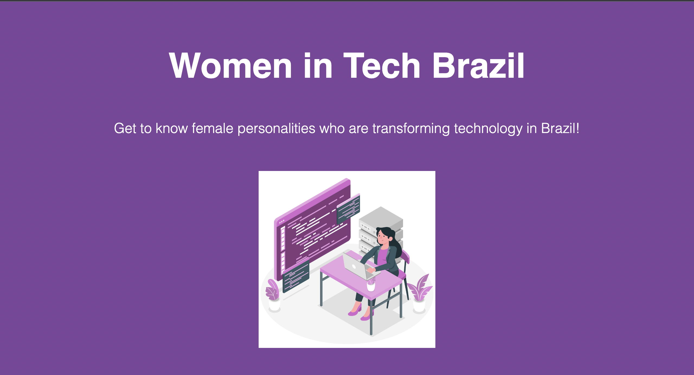

## 👯‍♀️ Women in Tech Brazil 👯‍♀️ 

Women in Tech Brazil is a project promoting gender diversity and inclusion in the tech industry. It utilizes a React.js frontend and a backend powered by MongoDB, Insomnia, and Mongoose. The frontend offers an intuitive interface for easy interaction. Users can browse profiles, submit new ones, and get inspired. MongoDB provides efficient and scalable storage. Insomnia tests and debugs API endpoints, ensuring smooth communication. Mongoose simplifies database interaction. 

## 🎯 Project Objective 

The objective of Women in Tech Brazil is to promote gender diversity and inclusion in the technology industry. It aims to empower women, foster networking opportunities, and inspire future generations to pursue careers in tech.

## 🖥 Project Image

&nbsp;

## ⚙️ Technologies

* React.js
* MongoDB
* Insomnia
* Mongoose

&nbsp;

### 🔗 Project live
* [Women in Tech Brazil ](https://front-programaria-react-roan.vercel.app/)

&nbsp;

Developed with 💜  by Joseane
